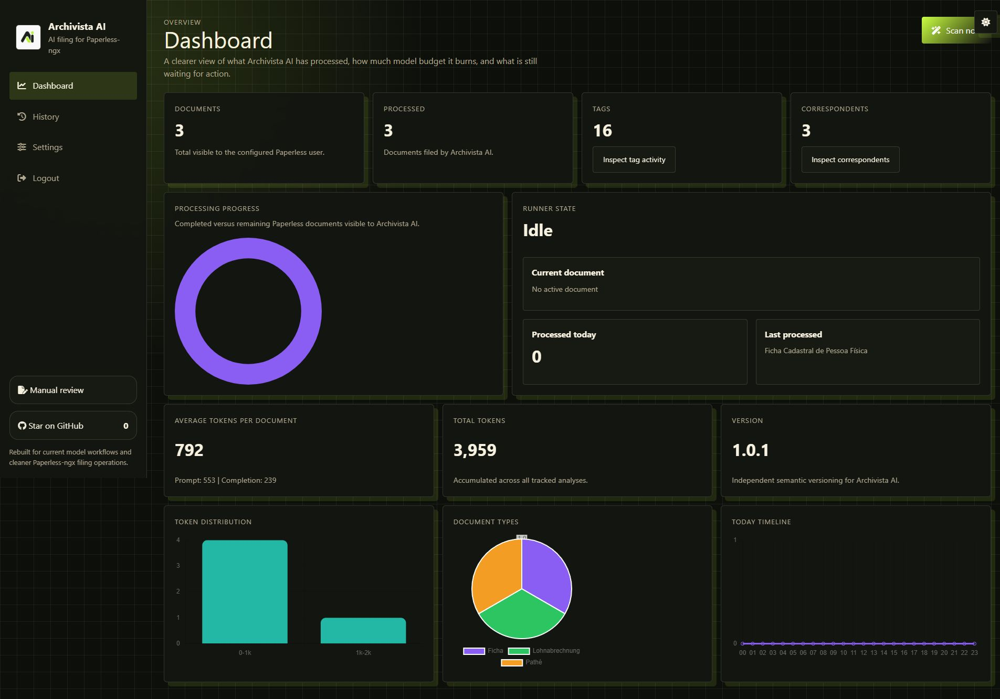

# Tagvico AI

> **⚠️ Alpha — under active development.**
> This project is currently in an **alpha** state. APIs, configuration schema, environment variables, the SQLite layout, and the TypeScript migration are subject to change without notice. Things will break. Pin a specific release tag if you need stability, and please open issues for anything that surprises you — feedback during alpha is what shapes the 1.0 API.

Self-hosted AI filing for [Paperless-ngx](https://docs.paperless-ngx.com/): turn OCR text into clean metadata — titles, tags, correspondents, document types, dates, languages, custom fields, and optional owner assignment — while keeping control of the model, cost mode, and the privacy boundary.

[](#-alpha--under-active-development)
[](LICENSE)
[](https://github.com/arturict/tagvico-ai/releases)
[](https://github.com/arturict/tagvico-ai/actions/workflows/ci.yml)



## Why Tagvico AI

- **Useful metadata, automatically** — titles, tags, correspondents, document types, dates, languages, custom fields, and optional owner assignment.
- **Your choice of model** — Ollama, OpenAI, Anthropic, OpenRouter, Azure OpenAI, an OpenAI-compatible endpoint, or an experimental local Codex sign-in.
- **Cost-aware processing** — pick immediate requests, OpenAI Flex, or asynchronous OpenAI/Anthropic batches.
- **Designed for homelabs** — one container, one persistent volume, and SQLite for processing history and retries.
- **Clear privacy boundaries** — keep processing on your network with a local endpoint, or explicitly choose a hosted provider.

## Quick start (about 2 minutes)

You need Docker Compose, a running Paperless-ngx instance, and a Paperless API token. No source checkout is required.

Create a new folder, save the following as `docker-compose.yml`, and run `docker compose up -d`:

```yaml
services:
  tagvico-ai:
    # Pin an immutable release tag for upgrades you can rely on.
    # See https://github.com/arturict/tagvico-ai/releases for the current version.
    image: ghcr.io/arturict/tagvico-ai:1.1.0
    container_name: tagvico-ai
    restart: unless-stopped
    cap_drop:
      - ALL
    security_opt:
      - no-new-privileges=true
    ports:
      - "8080:3000"
    environment:
      ARCHIVISTA_AI_PORT: "3000"
    volumes:
      - tagvico_ai_data:/app/data

volumes:
  tagvico_ai_data:
```

Open **<http://localhost:8080/setup>**. To confirm the container is ready first, run:

```bash
docker compose ps
curl http://localhost:8080/health
```

### Setup in four steps

1. **Start the container.** Run `docker compose up -d`, then open <http://localhost:8080/setup>.
2. **Connect Paperless-ngx.** Paste its base URL and an API token (Paperless-ngx → Settings → My API token). Do not add `/api` to the URL. If Paperless runs on the Docker host, use `http://host.docker.internal:<port>` on Docker Desktop or the host's LAN IP on Linux. If both apps share a Docker network, use the Paperless service name.
3. **Choose a model provider.** Pick OpenRouter for the fastest curated start, Ollama to keep everything on your own hardware, or any other supported provider (see below). Add the required key or endpoint.
4. **Decide what Tagvico may write.** Toggle tags, title, correspondent, document type, custom fields, and optional owner assignment, then finish setup. Tagvico scans on the configured cron interval — it does not need a restart.

The first run creates a tiny local admin account, stored in the SQLite database inside the persistent volume.

<details>
<summary><strong>Prefer a single docker run command?</strong></summary>

```bash
docker volume create tagvico_ai_data
docker run -d \
  --name tagvico-ai \
  --restart unless-stopped \
  --cap-drop ALL \
  --security-opt no-new-privileges=true \
  -p 8080:3000 \
  -e ARCHIVISTA_AI_PORT=3000 \
  -v tagvico_ai_data:/app/data \
  ghcr.io/arturict/tagvico-ai:1.1.0
```

</details>

## How it works

Tagvico polls Paperless-ngx for new documents, reads their OCR text and existing metadata, and asks the configured model for a structured filing suggestion. Validated values are written back to the original document. Processing history, token metrics, retries, and manual re-runs are available in the web UI.

Owner matching is conservative: optional hint profiles add context, and assignment only happens when the model output agrees with the available Paperless user information.

## Model providers

| Provider | Best for |
|---|---|
| OpenRouter | Curated cloud models with a preset picker (recommended default) |
| Ollama | Fully local inference |
| OpenAI direct | Native OpenAI access with Flex and Batch pricing |
| Anthropic direct | Claude with standard or discounted Message Batches |
| OpenAI-compatible | LM Studio, LiteLLM, vLLM, and custom gateways |
| Azure OpenAI | Existing Azure deployments |
| Codex subscription | Experimental local provider using the host's Codex CLI sign-in |

Provider-specific setup and troubleshooting live in [`docs/providers/`](docs/providers/README.md).

## Cost and processing modes

- **Standard** — process each document immediately. Best for interactive feedback and low-volume setups.
- **OpenAI Flex** — trades latency and guaranteed availability for Batch-level pricing. Available only for supported OpenAI models, selected in the provider step.
- **Batch** — asynchronous, discounted jobs that may take up to 24 hours. Available for OpenAI direct and Anthropic direct; Tagvico groups all documents discovered in the same scan into one batch.
- **Codex subscription (experimental)** — uses the Codex CLI account on this host instead of an API key. Run `codex login` inside the container or mount a Codex home directory first. No API key is stored by Tagvico, and the path is intentionally sandboxed read-only with approvals disabled. Codex models are optimized for coding, so document extraction quality is experimental.

## Upgrades

1. Check the latest release at <https://github.com/arturict/tagvico-ai/releases>.
2. Update the image tag in `docker-compose.yml` to the new **immutable version tag** — for example `ghcr.io/arturict/tagvico-ai:1.1.0`. Avoid `:latest` in production: it makes rollback ambiguous and can pull a breaking change unexpectedly.
3. `docker compose pull && docker compose up -d`.

Tagvico is stateless across restarts: configuration, processing history, and the local admin account live in the `tagvico_ai_data` volume, so upgrades do not touch your settings.

## Troubleshooting

- **Setup page does not load after first start.** Confirm the container is healthy with `docker compose ps` and `docker compose logs tagvico-ai`. The health endpoint is `http://localhost:8080/health`.
- **Cannot reach Paperless-ngx.** Use the "Test connection" button. Do not include `/api`. `localhost` inside the Tagvico container means that container—not your Docker host. Use `host.docker.internal`, the host LAN IP, or a shared Docker-network service name as described above.
- **Model calls fail.** Verify the API key and model slug in Settings. For Ollama and OpenAI-compatible endpoints, confirm the host is reachable from inside the container (`docker exec -it tagvico-ai curl ...`).
- **Batch jobs not completing.** Batch mode may take up to 24 hours and is only supported for OpenAI direct and Anthropic direct. Switch to Standard or Flex in Settings to process immediately.
- **Forgot the local admin password.** Stop the container, back up the volume, and recreate the admin by resetting setup state, or start a fresh `tagvico_ai_data` volume.

## Security and privacy

With Ollama or another endpoint on your network, OCR text and metadata can remain on infrastructure you control. When you select OpenAI, OpenRouter, or Azure, the document content required for classification is sent to that provider. Secrets are stored in `data/.env` and are not written to the processing database.

The container drops Linux capabilities and enables `no-new-privileges`. See [SECURITY.md](SECURITY.md) and [PRIVACY_POLICY.md](PRIVACY_POLICY.md) for the full policies.

## Development

```bash
git clone https://github.com/arturict/tagvico-ai.git
cd tagvico-ai
npm install
npm run dev
npm run typecheck
npm run lint
```

The development server listens on `http://localhost:3000`. The TypeScript migration is incremental; JavaScript remains the runtime source while typed modules are introduced and verified.

## Contributing

Bug reports, feature requests, and pull requests are welcome. The issue chooser asks only for the information needed to reproduce or evaluate a change, and the pull-request template includes a short verification checklist. See [CONTRIBUTING.md](CONTRIBUTING.md) for the workflow. For security disclosures, follow [SECURITY.md](SECURITY.md) instead of opening a public issue.

See [docs/STATUS.md](docs/STATUS.md) for the current development status, what may still change before 1.0, and recommendations for running alpha software in production.

## License

[MIT](LICENSE)
