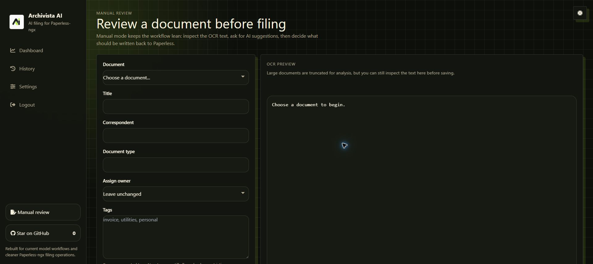

# Archivista AI

Self-hosted AI filing for [Paperless-ngx](https://docs.paperless-ngx.com/): turn OCR text into useful metadata while keeping control of the model, review flow, and privacy boundary.

[](LICENSE)
[](https://github.com/arturict/archivista-ai/releases)
[](https://github.com/arturict/archivista-ai/actions/workflows/ci.yml)


## Why Archivista AI

- **Useful metadata, automatically** — titles, tags, correspondents, document types, dates, languages, custom fields, and optional owner assignment.
- **Your choice of model** — Ollama, OpenAI, Anthropic, OpenRouter, Azure OpenAI, an OpenAI-compatible endpoint, or an experimental local Codex sign-in.
- **Cost-aware processing** — use immediate requests, OpenAI Flex, or asynchronous OpenAI/Anthropic batches.
- **Review before writing** — inspect suggestions, re-run documents, and choose which fields Archivista may update.
- **Designed for homelabs** — one container, one persistent volume, and SQLite for processing history and retries.
- **Clear privacy boundaries** — keep processing on your network with a local endpoint, or explicitly choose a hosted provider.

### Manual review



## Quick start

Save this as `docker-compose.yml`:

```yaml
services:
  archivista-ai:
    image: ghcr.io/arturict/archivista-ai:latest
    container_name: archivista-ai
    restart: unless-stopped
    ports:
      - "8080:3000"
    environment:
      ARCHIVISTA_AI_PORT: "3000"
    volumes:
      - archivista_ai_data:/app/data

volumes:
  archivista_ai_data:
```

Run `docker compose up -d`, then open `http://localhost:8080/setup`. Connect your Paperless-ngx instance, choose a model provider, and decide which metadata Archivista may write.

## How it works

Archivista polls Paperless-ngx for new documents, reads their OCR text and existing metadata, and asks the configured model for a structured filing suggestion. Validated values are written back to the original document. Processing history, retries, and manual re-runs are available in the web UI.

Owner matching is conservative: optional hint profiles add context, and assignment only happens when the model output agrees with the available Paperless user information.

## Model providers

| Provider | Best for |
|---|---|
| Ollama | Fully local inference |
| OpenAI | Direct hosted OpenAI access |
| Anthropic | Direct Claude access, including Message Batches |
| OpenRouter | A broad catalog through one API |
| OpenAI-compatible | LM Studio, LiteLLM, vLLM, and custom gateways |
| Azure OpenAI | Existing Azure deployments |
| Codex subscription | Experimental local provider using the host's Codex CLI sign-in |

OpenAI Flex trades latency and guaranteed availability for Batch-level pricing. Batch mode groups documents found in the same scan and may take up to 24 hours. The Codex option requires `codex login` on the machine or inside the container and is intentionally sandboxed read-only with approvals disabled; Codex models are optimized for coding, so this path is experimental for document extraction.

Provider-specific setup and troubleshooting live in [`docs/providers/`](docs/providers/README.md).

## Security and privacy

With Ollama or another endpoint on your network, OCR text and metadata can remain on infrastructure you control. When you select OpenAI, OpenRouter, or Azure, the document content required for classification is sent to that provider. Secrets are stored in `data/.env` and are not written to the processing database.

The container drops Linux capabilities and enables `no-new-privileges`. See [SECURITY.md](SECURITY.md) and [PRIVACY_POLICY.md](PRIVACY_POLICY.md) for the full policies.

## Development

```bash
git clone https://github.com/arturict/archivista-ai.git
cd archivista-ai
npm install
npm run dev
npm run typecheck
npm run lint
```

The development server listens on `http://localhost:3000`. The TypeScript migration is incremental; JavaScript remains the runtime source while typed modules are introduced and verified.

## Contributing

Bug reports, feature requests, and pull requests are welcome. See [CONTRIBUTING.md](CONTRIBUTING.md) for the workflow. For security disclosures, follow [SECURITY.md](SECURITY.md) instead of opening a public issue.

## License

[MIT](LICENSE)
