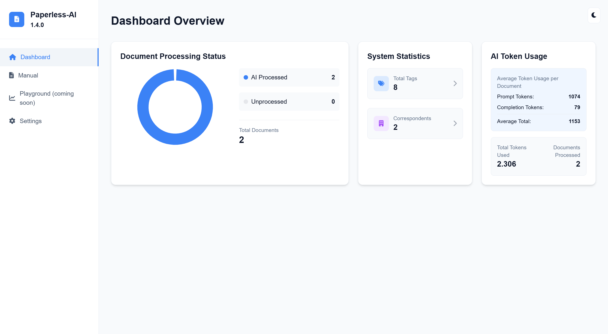

# Archivista AI

AI autopilot for [Paperless-ngx](https://docs.paperless-ngx.com/) — self-hosted document classification, tagging, and owner assignment.

[](LICENSE)
[](https://github.com/arturict/archivista-ai/releases)
[](https://github.com/arturict/archivista-ai/actions/workflows/ci.yml)

## What it does

Archivista AI connects to your Paperless-ngx instance, reads OCR content and existing metadata for incoming documents, and writes back useful filing information: a generated title, tags, correspondent, document type, document date and language, custom fields, and an optional Paperless user/owner assignment. The service polls Paperless for new documents, processes them through a configurable model provider, and updates the original record. The web UI exposes setup, history, manual re-runs, and a per-provider settings panel.



## Quickstart (Docker Compose)

Save the following as `docker-compose.yml` and run `docker compose up -d`:

```yaml
services:
  archivista-ai:
    image: ghcr.io/arturict/archivista-ai:latest
    container_name: archivista-ai
    restart: unless-stopped
    ports:
      - "8080:3000"
    environment:
      PAPERLESS_API_URL: http://paperless-ngx:8000
      PAPERLESS_AI_PORT: "3000"
      AI_PROVIDER: openai
      OPENAI_API_KEY: ${OPENAI_API_KEY}
      OPENAI_MODEL: gpt-5.4-mini
    volumes:
      - archivista_ai_data:/app/data

volumes:
  archivista_ai_data:
```

Then open `http://localhost:8080/setup`, scan for your Paperless-ngx instance, paste a Paperless API token, choose a model provider, and save. The setup wizard stores a non-secret snapshot in `data/.onboarding` and your secrets in `data/.env`.

## Model Providers

Archivista AI ships with provider adapters for:

- **OpenAI Direct** — `gpt-5.5`, `gpt-5.4`, `gpt-5.4-mini`, `gpt-5.4-nano`, `gpt-5.3`
- **OpenRouter** — routed access via `company/model` slugs (e.g. `anthropic/claude-sonnet-4.5`)
- **Ollama** — local models through the Ollama HTTP API
- **LM Studio / OpenAI-compatible** — any endpoint that speaks the OpenAI Chat Completions API
- **Azure OpenAI** — Azure-hosted OpenAI deployments

Per-provider environment variables and troubleshooting are documented in [docs/providers/](docs/providers/README.md).

## How it works

Archivista AI is a Node.js/Express service that talks to Paperless-ngx over its REST API. A polling loop scans for documents added since the last successful run, downloads the OCR text and current metadata, and builds a structured prompt for the configured model provider. The model's JSON response is validated against a schema and written back to Paperless as title, tags, correspondent, type, date, language, custom fields, and an optional owner.

Owners are resolved against Paperless user profiles (`username`, name, email) with optional hints like `alex: Alex M., private invoices, health insurance`. Matching is conservative: a document is only assigned to a user when the model output and the hint context agree, so unrelated files are never silently rerouted.

A small SQLite database tracks processed documents, retries, and error history. Failed runs are retried with exponential backoff, and the web UI shows the full history for inspection and manual reprocessing. The service is designed to be idempotent: re-processing a document overwrites its AI-derived fields without duplicating tags or correspondents.

The whole stack runs as a single container with no external database. The only outbound network calls are to your Paperless instance and to the model provider you configure — see the Security & Privacy section below.

## Roadmap

The full task list lives in [docs/agent-roadmap.json](docs/agent-roadmap.json). The four phases are:

- **Phase 0 — Trust reset.** Remove legacy upstream metadata, audit old names, and add the TypeScript scaffold.
- **Phase 1 — Maintainer-ready foundation.** CI, release flow, issue templates, demo material, and docs that make contribution safe.
- **Phase 2 — Differentiating product work.** Visible advantages over existing Paperless AI tools: cleaner setup, modern model routing, owner assignment, custom fields, and homelab-friendly operations.
- **Phase 3 — Community launch.** Real users, issues, feedback, stars, and release history before applying to OSS programs.

## Comparison

Archivista AI is built with current self-hosting workflows in mind and ships with a guided setup wizard, modern model routing, and person/owner assignment out of the box. **[paperless-gpt](https://github.com/paperless-ngx/paperless-gpt)** and **[paperless-ai](https://github.com/clusterzx/paperless-ai)** are the two most established projects in this space; both remain active and have shaped the conventions Archivista builds on. Where Archivista tries to differ is in onboarding speed (one-screen setup, automatic Paperless detection), broad provider choice (OpenAI, OpenRouter, Ollama, LM Studio, Azure), and owner assignment with hint profiles. If you already run one of the other two projects and it works for you, there is no reason to switch — Archivista is for users who want those three things in a single self-hosted package.

## Development

```bash
git clone https://github.com/arturict/archivista-ai.git
cd archivista-ai
npm install
npm run dev     # nodemon, auto-restart on file changes
npm start       # run the built server
npm test        # run the local smoke test
```

The dev server listens on `http://localhost:3000` by default. The TypeScript compiler is configured but optional — `tsc --noEmit` is exposed as `npm run typecheck`.

## Security & Privacy

Documents never leave your infrastructure unless you explicitly choose a hosted provider. With Ollama or a self-hosted OpenAI-compatible endpoint, OCR text and metadata are processed entirely on machines you control. With OpenAI, OpenRouter, or Azure, document content is sent to the provider you configure — pick the one whose data handling matches your threat model. Secrets (Paperless token, provider API keys) are stored in `data/.env` and never written to the database. The default container runs with all Linux capabilities dropped and `no-new-privileges`. See [SECURITY.md](SECURITY.md) for the vulnerability disclosure process and [PRIVACY_POLICY.md](PRIVACY_POLICY.md) for the full data-handling statement.

## Contributing

Bug reports, feature requests, and pull requests are welcome. See [CONTRIBUTING.md](CONTRIBUTING.md) for the workflow, the issue staleness policy, and the exempt labels that keep long-running discussions open.

## License

[MIT](LICENSE)

## Support

Open an issue at <https://github.com/arturict/archivista-ai/issues>. For security disclosures, follow the process in [SECURITY.md](SECURITY.md) instead of filing a public issue.
